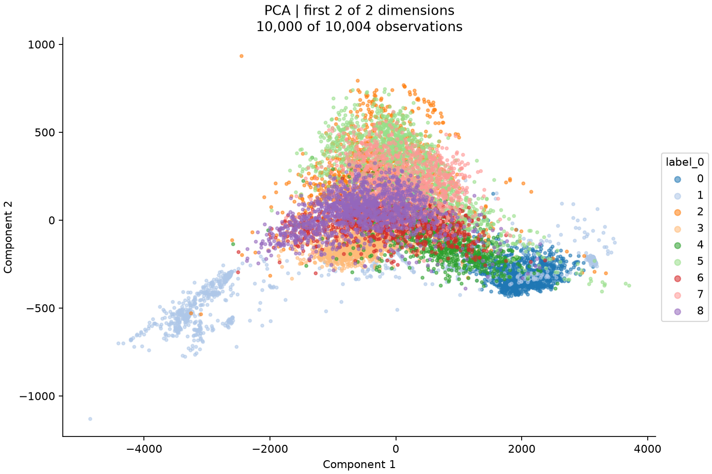

# generated_report_1

All suitable and feasible methods; results are reported separately, without ranking.

## Dataset and scope

The analysis concerns the caller-specified PathMNIST validation subset: 10,004 observations represented by 2,352 dense numeric RGB pixel features from a medmnist_npz input. The caller identified the values as intensities in shared 0–255 units, explicitly distinguished them from counts, and requested no new train/test split. The loader records C-order flattening of image axes with spatial layout recorded; this establishes the numeric representation used here, not a learned spatial or biological similarity measure. All observations entered the fit. The metadata column label_0 contains nine nonmissing categories and was excluded from the features, so the analysis is unsupervised despite the availability of labels for display.

The application-default all_suitable policy produced a set of scientific suitability assessments rather than a ranking. PCA, metric Euclidean MDS, RBF Kernel PCA, normalized Laplacian Eigenmaps, Gaussian Diffusion Maps, t-SNE, and UMAP were judged suitable for their respective exploratory objectives; Isomap and standard LLE lacked sufficient supporting diagnostics. Resource screening then left only PCA eligible for execution. Accordingly, this consolidated report contains one fitted result and separately explains each exclusion, without treating unexecuted methods as failed fits or using PCA's subsequent metrics to justify earlier selection decisions. The suitability statements are recorded model judgments conditional on the fixed representation, not caller endorsements or validated scientific findings.

Supporting evidence: [configuration](evidence.json), [input_profile](evidence.json), [preprocessing](evidence.json), [pca.execution](evidence.json), [selection_set](evidence.json), [pca.outcome](evidence.json)

## Preprocessing decisions

Preprocessing deliberately retained the original intensity scale, with no scaling, total-count normalization, log1p transformation, or preprocessing centering. The recorded reason was to preserve shared RGB intensity units and relative variation, supported by the caller's statement that these are not counts. Nonnegative integer values alone would not have justified a count model. This choice leaves feature variation on its original scale and therefore determines the variance and Euclidean-distance objectives; common units do not establish that every pixel is equally informative or that intensity distance represents biological similarity. Preprocessing itself performed no dimensionality reduction. Its center=false setting does not imply uncentered PCA: the selected estimator subsequently centered features as part of its variance-based fit.

No features or observations were dropped, no imputation was performed, and constant removal was disabled because the input profile reports zero missing values, infinite values, all-missing features, and constant features, with all 2,352 features numeric. Error policies remained in place for missing, infinite, all-missing, and categorical inputs; no categorical expansion was needed. The plan retained its 100,000-output-feature and 1,000,000,000-byte dense limits rather than increasing resources, with no dataset-specific scientific justification recorded for these numerical safeguards. The unchanged output shape was 10,004 by 2,352. Diagnostics found no exactly duplicated rows among 512 sampled observations, but that does not establish absence of duplicates throughout the dataset; unusual distances and duplicates were diagnostic subjects, not automatic removal criteria.

Supporting evidence: [preprocessing](evidence.json), [configuration](evidence.json), [selection_set](evidence.json), [pca.execution](evidence.json), [input_profile](evidence.json), [diagnostics](evidence.json)

## Method and hyperparameters

Centered PCA was included to summarize variance linearly in the unchanged numeric representation without imposing a manifold assumption. At decision time, the 512-row diagnostics showed feature variances ranging from 856.9819 to 2,223.7649, with median 1,005.0478 and no zero-variance features. These observations supported the presence of variation but supplied neither a covariance spectrum nor evidence that two components would suffice. The planner selected randomized SVD because the dense 10,004-by-2,352 input was eligible and only two components were requested, permitting an approximate calculation without a full decomposition. The decision was computational and objective-specific; the later explained-variance result was not available as its justification.

The output dimension was fixed at two by application defaults and was retained by the selection plan. No automatic dimension search occurred, so the configured search candidates and targets were inactive and did not select or validate this dimension. Execution used randomized SVD, random_state=0, and whiten=false as specified in the plan: estimator centering defines the centered variance objective, and omitting whitening retains unequal component variances. Effective numerical settings included seven power iterations, ten oversamples, QR power-iteration normalization, and copy=true. These are recorded implementation settings supporting the approximate decomposition; their individual numerical values have no supplied dataset-specific scientific justification or tuning history. Seed 0 supports repeatability, not robustness across seeds. The evidence does not separately identify the provenance of each numerical solver setting as an application default, library default, or explicit backend choice, so conventional computational roles should not be mistaken for individually validated parameter selections.

Metric Euclidean MDS was judged suitable for asking how well the fixed Euclidean dissimilarities can be represented in two dimensions. The concrete diagnostic support was 130,816 sampled pairs with positive distances from 36.0416 to 7,568.3356, median 2,161.4812, and coefficient of variation 0.3814763. These values demonstrate nondegenerate sampled dissimilarities, not low achievable stress. MDS was excluded because 10,004 observations exceeded the 5,000-observation manifold gate and its conservative dense/pairwise working-array screen exceeded the 1,000,000,000-byte limit; no automatic fitting subsample was permitted. The assessment also noted that a single random initialization with seed 0 could reach a local solution, but no MDS fit or measured stress exists here. Its distance-preservation objective is distinct from PCA's variance objective.

Isomap was excluded scientifically because sampled graph connectivity did not justify interpreting shortest paths as relevant geodesic distances. Undirected union nearest-neighbor graphs at k=5, 15, and 30 each formed one component containing all 512 sampled rows, with no recorded boundary-distance ties; nevertheless, connected graphs may contain shortcut edges or inappropriate bridges. Full-data connectivity and geodesic fidelity were unverified. Isomap also failed the manifold observation and dense/pairwise workspace gates, independently of this scientific judgment. Standard LLE was excluded for a different reason: no local rank, reconstruction-residual, or conditioning diagnostics established stable and informative local linear reconstruction weights. The absence of sampled exact duplicates and the same connectivity results do not supply that missing evidence. LLE supported dense storage but failed the 5,000-observation gate; its feasibility record does not report the additional workspace rejection assigned to Isomap.

RBF Kernel PCA was considered scientifically suitable for exploratory nonlinear similarity representation because positive, variable sampled distances support a nondegenerate Gaussian similarity construction. It was excluded by both the observation gate and the conservative new-method pairwise/workspace screen. The assessment mentioned a median-distance bandwidth only as a possible heuristic, not an executed, optimized, or scientifically preferred value. No evidence establishes the best full-data bandwidth or that two kernel components would capture the relevant similarity structure. Kernel eigenvalues would describe a different representation from original-feature PCA variance and cannot be substituted for its explained-variance ratios.

Normalized Laplacian Eigenmaps was judged suitable for exploratory preservation of Euclidean graph adjacency, with the connected sampled union graphs providing limited decision-time support. A connected full-data union binary graph remained a mandatory prerequisite, and that prerequisite was not verified. The method was excluded by the observation and conservative new-method workspace gates even though sparse graph implementations are possible. Binary adjacency would discard distance magnitudes, and neither the tested sample neighbor counts nor connectivity establish a suitable full-data neighborhood scale or biologically meaningful edges. No full-data graph or embedding was executed, so the suitability judgment is explicitly conditional.

Gaussian Diffusion Maps was included in the scientifically suitable set for exploratory representation of multistep Euclidean similarity, supported by the same positive, variable sampled distances. It was excluded from fitting by the observation and conservative new-method workspace gates. A bandwidth based on median positive squared distance was discussed only as a heuristic; density correction alpha and diffusion time had no scientifically preferred values established by the evidence. These choices would respectively influence affinity scale, treatment of sampling density, and attenuation of modes, but no fitted parameters or spectrum are available. Suitability for this mathematical exploration does not establish a physical diffusion process, a biological trajectory, or an intrinsic manifold.

t-SNE was judged suitable for exploratory local-similarity visualization because the sampled median nearest-neighbor distance, 1,082.7285, was approximately half the median pairwise distance of 2,161.4812; the recorded ratio was 0.5009197. This is limited evidence of local distance contrast, not validation of full-data neighborhoods or an optimal perplexity. Two dimensions were supported by Barnes-Hut t-SNE, but the method failed both the observation and conservative new-method workspace gates. The assessment required random initialization with seed 0 and no preliminary PCA if execution were to occur; neither a fit nor a perplexity selection occurred. Its objective does not require preserving global Euclidean distances, and apparent group sizes, axes, or intergroup distances would not provide calibrated global geometry or biological validation.

UMAP was likewise judged suitable for exploratory local Euclidean neighborhood relationships, using sampled distance contrast and sampled connectivity as limited support. It was excluded by the observation and conservative new-method workspace screens despite the possibility of sparse graph storage. No scientifically preferred neighbor count or min_dist was established, and no values were fitted or optimized. Conditional execution requirements were random initialization and seeded single-thread optimization with seed 0, without preliminary PCA or spectral initialization; these requirements never became an executed configuration. Sample connectivity cannot establish full-data connectivity, and disconnected component placement would require caution. UMAP's local objective would not make low global Euclidean distortion, intergroup layout, or apparent classes reliable biological conclusions.

Supporting evidence: [selection_set](evidence.json), [diagnostics](evidence.json), [input_profile](evidence.json), [configuration](evidence.json), [pca.execution](evidence.json)

## Results and interpretation

PCA completed one execution attempt on all 10,004 observations and returned a 10,004-by-2 embedding. The fitted explained-variance ratios were 0.5453597453 and 0.02260596225, corresponding to approximately 54.536% and 2.261% of total variance, or 56.797% together. Thus approximately 43.203% of original-feature variance remained outside this representation. The singular values were 131,340.2752 and 26,740.3989. These post-fit quantities document a strongly unequal allocation of retained variance across the two coordinates and substantial omitted variation; they do not establish the biological importance of either retained or omitted directions. They quantify the specific centered, unscaled PCA objective and do not retrospectively validate the fixed dimension as sufficient.

Geometric evaluation on 512 observations reported trustworthiness 0.8114312 and five-neighbor overlap 0.13828125. The latter indicates that only about 13.83% of the evaluated neighbor memberships were shared under the reported overlap measure, while trustworthiness describes rank-weighted neighborhood intrusion and is not an interchangeable retention percentage. Distance Spearman correlation was 0.8096712, normalized distance error was 0.3926912, and scale-aligned distance error was 0.3522550 using distance scale factor 1.2276648. The reduction after scale alignment indicates that a global rescaling accounts for part, but not all, of the measured discrepancy. Together these results describe some preservation of broad distance ordering alongside considerable distance and local-neighborhood changes, without imposing a universal pass/fail threshold.

Embedding and view metrics are identical because both refer to the same two-coordinate representation: the view did not introduce another dimensionality reduction. Both metric records have empty skipped-result dictionaries, and evaluation completed. By contrast, the supplied image displays 10,000 observations, the application-default plotting cap, rather than the 512 used for geometric scores. The plot uses categorical label_0 under the default limit of 20 displayed categories; its nine categories contain no missing labels, and label values color the display without affecting fitting or scores. The configured report color override was null, so this recorded metadata coloring should not be described as a caller-selected feature or supervised evaluation. Image-specific observations are reported separately in visual_interpretations.

Supporting evidence: [pca.execution](evidence.json), [pca.evaluation](evidence.json), [pca.embedding](evidence.json), [pca.view](evidence.json), [pca.visual](evidence.json), [configuration](evidence.json), [input_profile](evidence.json)

## Constraints and uncertainty

Resource eligibility followed unchanged application defaults of 1,000,000,000 working bytes and at most 5,000 observations for manifold methods; the selection record explicitly disallowed automatic fitting subsampling, preprocessing changes, label use for modeling, and resource-limit changes. A float64 input array was estimated at 188,235,264 bytes and one dense pairwise array at 800,640,128 bytes. The latter alone is below the working-byte threshold, but the recorded conservative screens concern working arrays together, explaining why pairwise/workspace exclusions can still occur. Exact aggregate estimates for each rejected method are not supplied. These gates are operational policy, not claims that the methods are intrinsically impossible at this size; sparse implementations were still rejected under the configured conservative screen. Array estimates exclude input-loading costs or other overhead as specified and are not hard process RAM guarantees.

Diagnostics and evaluation each used application-default caps of 512 observations and 128,000,000 working bytes with seed 0. Diagnostics materialized a dense sample and estimated 55,462,912 working bytes; the configured neighbor counts 5, 15, and 30 examine several local scales but have no individual scientific optimization recorded. Evaluation used five neighbors and two threads, also defaults, to provide bounded, reproducible descriptive calculations. The no-sampling restriction on fitting did not prevent these separately configured diagnostic, evaluation, and plotting samples. Neighborhoods and their ranks refer to the evaluation sample, not all 10,004 observations, and ties can influence ranks. Although the source split is called validation, the embedding was fitted on these observations, so these geometric scores are in-sample descriptions rather than held-out validation or measures of biological truth.

Execution retained the default 600-second timeout per attempt, two threads, and permission for fallback; these are operational settings with no individual scientific rationale recorded for their numerical values. The sole PCA attempt completed in 1.027265167 seconds with no warnings, no failed attempt, no fallback, and zero fallback-planner calls. Preprocessing and selection validation histories were empty, and no metric was skipped. Accordingly, the resource exclusions described above are the only recorded barriers to additional method execution, with Isomap and LLE also carrying scientific exclusions; there is no failed-fit sequence or substitute estimator to explain. Successful completion and a repeatable seed do not quantify randomized-SVD approximation error or establish stability to other seeds, preprocessing choices, or dimensions.

Supporting evidence: [configuration](evidence.json), [input_profile](evidence.json), [selection_set](evidence.json), [diagnostics](evidence.json), [pca.evaluation](evidence.json), [pca.embedding](evidence.json), [preprocessing](evidence.json), [pca.execution](evidence.json), [pca.view](evidence.json)

## Evidence gaps

Decision-time evidence lacked a covariance spectrum, full-data graph connectivity, validated geodesic distances, and local rank or conditioning diagnostics. The PCA fit now supplies two explained-variance ratios, but it does not supply the remaining spectrum, component loadings, scientific interpretations of the axes, or a tested dimension-selection curve. No repeated-seed study, parameter sensitivity analysis, confidence intervals, or held-out geometric evaluation is provided. These absences limit conclusions about dimensional adequacy and stability; they do not turn the excluded methods into negative empirical results. No numeric-label-to-tissue mapping or independent biological validation is supplied, so neither label colors nor geometric scores establish biological classes or causes.

The supplied records preserve configuration provenance, preprocessing and selection decisions, execution attempts, effective PCA settings, and sampled evaluation quantities, which are the ledgers underlying a detailed individual method report. No separate individual-report text or report link is supplied here, so this consolidation does not claim to have inspected such reports, raw observations, or unprovided plots. Reproducibility metadata record Python 3.13.2, NumPy 2.5.3, SciPy 1.18.1, and scikit-learn 1.9.1, together with input and embedding hashes linking the stages; these identify recorded artifacts and software rather than independently verifying their contents. No actual estimator settings or outcomes exist for the excluded branches, and missing bandwidths, perplexities, neighborhood parameters, or optimization results cannot be filled in with conventional values and presented as executed science.

Supporting evidence: [selection_set](evidence.json), [diagnostics](evidence.json), [pca.execution](evidence.json), [pca.evaluation](evidence.json), [input_profile](evidence.json), [configuration](evidence.json), [preprocessing](evidence.json), [pca.visual](evidence.json)

## Visual interpretation

The reporting model was supplied the saved PNGs listed below. Observations are model interpretations, not independently validated clusters or biological identities.

### pca

**Image assessment:** inspected.

The central concentration contains extensive overlap among the displayed colors. Purple label 8 is prominent around the central horizontal band, while pink label 7 and light-green label 5 extend above it; orange label 2 is dispersed through this region and reaches higher vertical positions. Red label 6 and pale-orange label 3 also overlap the center and its lower portion. These concentrations have overlapping boundaries rather than clean gaps separating every color.

Toward the lower right, blue label 0 forms a relatively compact concentration adjoining green label 4 and other colors. Light-blue label 1 extends into an elongated lower-left arm and is also scattered elsewhere. Sparse points lie beyond the main concentrations, including at the far lower left and above the central cloud. The horizontal coordinate spans several thousand units, whereas the vertical coordinate spans roughly a couple of thousand; the two displayed axes therefore have substantially different numerical scales.

The visible overlap and extended layout are compatible with a projection that retains broad variation while changing many local relationships: the fit retains approximately 56.80% of original-feature variance, and the separate 512-observation evaluation reports distance Spearman correlation 0.80967, trustworthiness 0.81143, and five-neighbor overlap 0.13828. Those numbers are measured evidence, not estimates from the image. Color overlap does not measure any of these label-independent scores, and the 10,000-point plot cannot establish their values or numerical convergence.

This image displays 10,000 of the 10,004 fitted observations, whereas geometric metrics use 512 sampled observations. It shows both coordinates of the saved two-dimensional PCA representation without another fit. Dense overplotting, transparency, and occlusion prevent precise counts or reliable comparisons of class abundance and point density; four observations are absent from the display. The profile reports no missing labels, and the legend displays numeric categories 0–8, but these codes provide no tissue or cell identities.

Unequal numerical axis scales and the plotting aspect affect perceived elongation and separation. PCA distances describe a linear projection that omits approximately 43.20% of total variance, so visible gaps and adjacency do not validate full-feature neighborhoods, biological classes, or causes. No nonlinear embedding is supplied for inspection; restrictions on interpreting nonlinear intergroup distances cannot be resolved from this PCA image, and no visual impression establishes convergence.

Source records: [pca.visual](evidence.json), [pca.embedding](evidence.json), [pca.evaluation](evidence.json), [input_profile](evidence.json)

## pca

Status: execution_complete

[Complete decisions, settings and results](methods/pca/generated_report_1.md)

Execution evidence: [pca.execution](evidence.json)

## Supporting records

The [full evidence record](evidence.json) preserves original selection and exclusion assessments, configuration provenance, preprocessing, diagnostics and results. Method-level reports linked above retain the complete technical ledgers.
