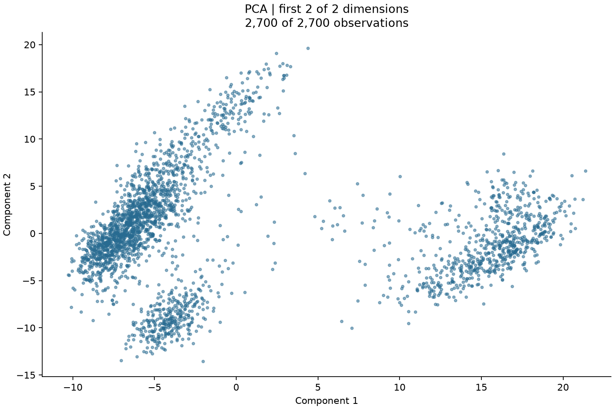
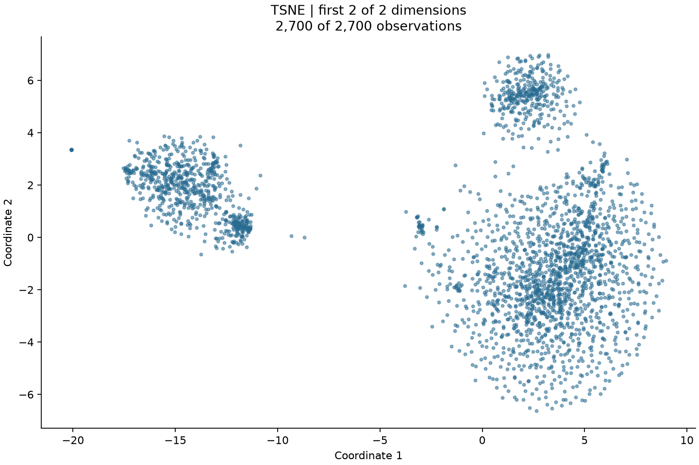
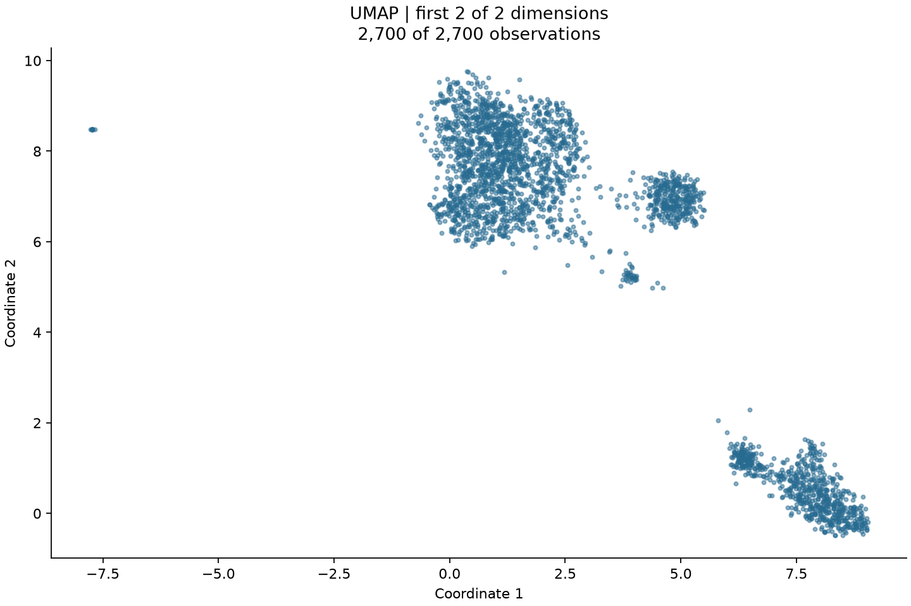

# generated_report_2

All suitable and feasible methods; results are reported separately, without ranking.

## Dataset and scope

This analysis describes a set of four selected methods—PCA, metric MDS, t-SNE and UMAP—applied sequentially to the same transformed observations, with each result interpreted according to its own objective. The input profile records a sparse CSR 10x matrix containing 2,700 observations and 32,738 numeric features, with a zero fraction of 0.9741281, no missing or infinite values, and 16,104 constant features. The loader transposed the 10x matrix into observations by features without changing counts, consistent with the caller's confirmation that these are raw nonnegative integer UMI counts arranged as cells by genes. This establishes the analysis orientation and data interpretation used by the pipeline; it does not supply independent biological annotation or cell-quality assessment.

The analysis retains all cells without additional cell-quality filtering or variable-gene selection, consistent with the confirmed experiment scope. No cell-type labels or new train/test split were supplied. The application default policy was all_suitable, and the selection model judged the four executed methods suitable within that scope; their inclusion is not a ranking or a claim that their objectives are interchangeable. Fixed two-dimensional output was an application default preserved by the plans for visualization; it was not an estimate of intrinsic dimension. Automatic dimension search was inactive, so its configured candidates and targets neither selected these outputs nor constitute criteria that the fits passed.

Supporting evidence: [input_profile](evidence.json), [configuration](evidence.json), [selection_set](evidence.json), [preprocessing](evidence.json)

## Preprocessing decisions

The preprocessing model chose per-cell total-count normalization to 10,000 followed by log1p because the caller confirmed raw UMI counts: the recorded purposes were to account for differing count totals and compress the count range. The exact target of 10,000 has no individual dataset-specific scientific justification in the supplied record. The plan required rejection of negative or noninteger counts and zero-total rows before transformation, explicitly because row totals were not established by the input profile, and prohibited silently dropping cells. Preprocessing completed with all 2,700 observations retained, but the supplied summary does not expose the row-total distribution or a separate log of those validation checks; completion is not a quantitative assessment of normalization effects.

Automatic constant-feature removal was chosen because the profile reported 16,104 constants with no across-cell variation, while the truncated feature details were insufficient for a complete explicit drop list. The resulting matrix contained 16,634 features, consistent with removing that number from the original 32,738, and the explicit drop list remained empty. Scaling was disabled and preprocessing centering was omitted to preserve sparse storage, as stated in the plan; these choices also leave transformed features with unequal variances and are not evidence that this weighting is scientifically optimal. Centering within the subsequent sparse-compatible PCA estimator is a separate operation from preprocessing centering, and no uncentered TruncatedSVD substitution was made.

The plan retained error policies for missing, infinite, all-missing and categorical inputs rather than introducing imputation or encoding. The profile's zero missing and infinite counts, zero all-missing features and entirely numeric feature set supplied no observed need for those interventions; sparse zeros were treated as count values, not missing entries. All cells were retained and additional quality filtering and variable-gene selection were deliberately omitted under the caller's instruction, not because the cells had been shown to pass quality thresholds. No dimensional reduction ran during preprocessing, and no preliminary PCA was added before t-SNE or UMAP. The preprocessing guardrails allowed at most 100,000 output features and 1,000,000,000 dense bytes, with a categorical cap of 100 that was not exercised here; these are recorded operational bounds without individual scientific calibration.

Supporting evidence: [preprocessing](evidence.json), [configuration](evidence.json), [input_profile](evidence.json), [pca.execution](evidence.json), [selection_set](evidence.json)

## Method and hyperparameters

Selection-time scientific assessments used only the recorded 231-observation diagnostic sample. Its 26,565 Euclidean pairs had median distance 62.7043, interquartile range 60.2496–64.9555 and coefficient of variation 0.0540506; median nearest-neighbor distance was 56.1757, giving a median-nearest to median-pairwise ratio of 0.8958827. These measurements supported the model's concern about weak local distance contrast. Undirected union nearest-neighbor graphs were connected at k=5, 15 and 30, each spanning all 231 sampled observations, with no recorded boundary-distance ties. That connectivity does not establish meaningful neighborhoods, an optimal neighbor count or full-data connectivity, and concentrated sampled distances do not prove that the full dataset lacks manifold structure. These were reasons available before fitting, distinct from the later embedding metrics.

PCA was included as a centered linear variance summary of the fixed transformed features that does not require a manifold assumption. Sparse-input eligibility and the execution contract motivated the explicit ARPACK solver choice, preserving centered PCA without manual densification. The fit retained two components, seed 0 and no whitening; disabling whitening preserves the component variance scales rather than equalizing them. Its effective ARPACK tolerance was 0.0, a retained estimator setting without a separate scientific justification in the record. There was no covariance spectrum at selection time, so neither the sparse feasibility result nor sampled feature variances established that two components would adequately summarize the data.

Metric Euclidean MDS was included to examine a representation whose objective directly concerns global input distances, despite the diagnostic concern that concentrated distances could be difficult to preserve in two dimensions. Eligibility was supported by 2,700 observations being below the 5,000-observation gate and one dense pairwise array requiring 58,320,000 bytes. The plan specified max_iter=300 and eps=0.000001, with one random initialization, seed 0, one estimator job and unnormalized stress. The recorded rationale describes the iteration and tolerance settings as conventional, not optimized; no individual scientific calibration is supplied for the single start. Passing the resource screen permits the attempt but does not guarantee low distortion, a favorable local solution or convergence.

t-SNE was included for exploratory visualization of local similarities, a narrower interpretation than asserting a global metric or intrinsic manifold. Its two-dimensional output satisfied the Barnes-Hut requirement of one to three dimensions, and the plan used Euclidean input, random initialization and no preliminary PCA. Perplexity 30 is a conventional local scale below 2,700 observations, not an optimum inferred from the diagnostic k-neighbor graphs; early exaggeration 12, automatic learning rate and a 1,000-iteration budget were recorded as standard optimization choices. The effective implementation also retained Barnes-Hut angle 0.5, minimum gradient norm 0.0000001, a 300-iteration no-progress limit, one estimator job and seed 0. Those additional values have no individual scientific justification in the record, and the realized numeric automatic learning rate was not reported. Random initialization was prescribed by the plan, but its superiority to another initialization was not established.

UMAP was included as an exploratory Euclidean-neighborhood visualization with explicit restraint about uncertain local contrast. The selected n_neighbors=15 is a conventional valid neighborhood scale, and min_dist=0.1 permits compact visual neighborhoods; connectivity of the 15-neighbor diagnostic sample was not evidence that this scale is optimal for the full dataset. The plan specified 200 epochs, learning_rate=1.0, random initialization, seed 0 and single-thread optimization, without preliminary PCA or spectral initialization. These were conventional or explicitly prescribed execution choices, not empirically tuned values. Effective settings also retained Euclidean output distance, spread=1.0, local_connectivity=1.0, set_op_mix_ratio=1.0, repulsion_strength=1.0, negative_sample_rate=5 and low_memory=true, jointly specifying graph construction, attractive and repulsive layout behavior and memory handling. No separate scientific justification is recorded for each retained value; standard UMAP was used without density-preserving densMAP or label supervision, so layout density and group spacing do not have a validated quantitative interpretation.

Isomap was excluded by scientific judgment despite computational eligibility, because interpreting graph paths as intrinsic distances requires meaningful local Euclidean neighborhoods, and weak sampled contrast plus sample-only connectivity did not provide that support. Connected graphs can contain inappropriate bridges, so the diagnostic result did not resolve the geodesic concern. Standard LLE was separately judged insufficiently supported because stable local reconstruction weights require conditioning and reconstruction evidence that was absent. LLE also failed an independent execution-contract gate: sparse LLE was unsupported and implicit densification prohibited. The absence of exact duplicates among 231 sampled rows does not establish stable local solves or duplicate absence throughout all 2,700 observations. Neither exclusion establishes that these methods could never be useful under a different justified analysis.

RBF Kernel PCA was excluded despite passing the quadratic-storage screen because the record supplied no specific nonlinear feature objective to justify introducing bandwidth-defined kernel geometry under the observed distance concentration. A median-distance bandwidth would have been a heuristic rather than an optimized or validated scale, other bandwidths could change the result, and kernel eigenvalues would not be original-feature explained variance. Laplacian eigenmaps was also computationally eligible but excluded because binary graph membership was not sufficiently supported as the scientific geometry: weak neighbor contrast remained unresolved, binary edges discard distance strength, and the required connected full-data union binary graph was not established by sampled connectivity. These were selection judgments rather than failed fitting attempts.

Diffusion maps passed the recorded dense quadratic affinity-storage screening but was excluded because no supported diffusion objective, affinity scale or treatment of sampling density was available. The diagnostic distance concentration offered limited basis for interpreting Gaussian-kernel transport: median epsilon would have been only a bandwidth heuristic, alpha would determine density correction without evidence about whether that density should be retained, and diffusion time would impose an unsubstantiated smoothing scale. No fit was attempted, so this exclusion provides no measured evidence about diffusion-map performance. It records insufficient justification for that particular interpretation within the present scope.

Supporting evidence: [diagnostics](evidence.json), [selection_set](evidence.json), [pca.execution](evidence.json), [mds.execution](evidence.json), [input_profile](evidence.json), [configuration](evidence.json), [tsne.execution](evidence.json), [umap.execution](evidence.json)

## Results and interpretation

All four methods produced 2,700-by-2 embeddings from the same preprocessed input, and all four evaluations completed. Geometric evaluation used 128 observations and five neighbors per method, whereas the diagnostic sample contained 231 observations and each plot displayed all 2,700. Evaluation settings used application-default seed 0, a maximum of 512 observations and a 128,000,000-byte working-memory allowance; the working-array estimate reduces the candidate sample from 512 to 256 and then 128 to fit that budget. The exact positions are retained in each method's bundled evaluation JSON. Trustworthiness addresses rank penalties for neighbors introduced by an embedding, neighbor overlap addresses shared sampled neighbor sets, and distance Spearman correlation addresses distance ordering. Normalized and scale-aligned distance errors describe Euclidean discrepancies before and after a fitted scale adjustment. These are descriptive in-sample measurements relative to the transformed feature space, with no universal pass/fail threshold; they neither validate biological structure nor retroactively justify the original selections.

PCA explained variance ratios were 0.04524547 and 0.01603384, totaling approximately 0.06127931, or 6.13% of transformed-feature variance; the corresponding singular values were 489.3635 and 291.3150. This post-fit result quantifies the limited variance represented by the fixed pair of components without determining biological relevance or the number of components that would be adequate for another purpose. On 128 observations, trustworthiness was 0.74671875, five-neighbor overlap 0.1546875 and distance Spearman correlation 0.57748274. Normalized distance error was 0.80478550 and scale-aligned error 0.52758873, with scale factor 3.51360001, so appreciable discrepancy remained after accounting for uniform scale. The recorded fit completed in 0.8513 seconds without warnings; this timing describes the run and is not a performance comparison.

Metric MDS returned raw stress 2,276,738,352.42381 after 300 iterations, with iteration_limit_reached=true. Execution completion therefore means an embedding was produced, not that the requested convergence tolerance was reached; the single random start also leaves sensitivity to local solutions unassessed. On the 128-observation evaluation sample, normalized distance error was 0.40217597, scale-aligned error 0.40132842 and scale factor 1.02932685, indicating that uniform rescaling changes this particular error only slightly. Distance Spearman correlation was 0.53374438, trustworthiness 0.664609375 and five-neighbor overlap 0.0921875. The raw stress concerns the full fitted MDS objective and is not interchangeable with these sampled normalized quantities, PCA variance or t-SNE KL divergence. The fit took 23.0592 seconds and recorded no warnings, despite the explicit iteration-limit flag.

t-SNE returned KL divergence 2.79414701, reported n_iter=999 under max_iter=1000, and explicitly flagged iteration_limit_reached=true. This records the optimization state at the budget boundary rather than proof of convergence, and the KL value has meaning within the t-SNE similarity objective rather than as explained variance or MDS stress. Its 128-observation evaluation yielded trustworthiness 0.7728125, five-neighbor overlap 0.196875 and distance Spearman correlation 0.53241556. Normalized distance error was 0.84907299 and scale-aligned error 0.57611112, with scale factor 4.22073947. These distance results limit global Euclidean interpretation of the display, while they do not directly measure success on the KL objective. Execution took 13.7270 seconds, with no warnings or retry recorded.

UMAP's fitted graph had one connected component and 74,298 directed edges, with disconnected_layout_caution=false. This is post-fit evidence about the actual UMAP graph, and it narrows the earlier uncertainty about that graph's connectivity without validating its neighborhood membership or establishing connectivity for the different graphs contemplated by excluded methods. The 128-observation evaluation reported trustworthiness 0.70752604, five-neighbor overlap 0.134375 and distance Spearman correlation 0.44847154. Normalized distance error was 0.92375180 and scale-aligned error 0.59418882, with scale factor 8.28884763, documenting substantial departures from global Euclidean distances without treating their minimization as UMAP's objective. The 200-epoch fit completed in 10.9880 seconds, but no optimization loss or convergence diagnostic was supplied; graph connectivity and an epoch count do not fill that gap.

Supporting evidence: [pca.execution](evidence.json), [mds.execution](evidence.json), [tsne.execution](evidence.json), [umap.execution](evidence.json), [pca.evaluation](evidence.json), [mds.evaluation](evidence.json), [tsne.evaluation](evidence.json), [umap.evaluation](evidence.json), [pca.embedding](evidence.json), [mds.embedding](evidence.json), [tsne.embedding](evidence.json), [umap.embedding](evidence.json), [diagnostics](evidence.json), [configuration](evidence.json)

## Constraints and uncertainty

Resource decisions followed operational application defaults: a 1,000,000,000-byte working-memory screen, a 5,000-observation manifold gate, a 600-second timeout per execution attempt and a two-thread execution allowance. The raw dense float64 input estimate was 707,140,800 bytes and a single pairwise matrix 58,320,000 bytes; those are array sizes rather than total-process memory estimates. All selected methods passed the recorded eligibility checks, as did the excluded methods other than sparse LLE. MDS, t-SNE and UMAP nevertheless recorded n_jobs=1, with single-thread UMAP explicitly prescribed by its plan. These limits made the work bounded but were not scientifically calibrated for this dataset, and the screens exclude loading costs and library overhead, so they are not hard process-RAM guarantees.

Diagnostics were restricted to a 231-observation sample under a default maximum of 512 and a 128,000,000-byte allowance; the estimated working size was 127,438,208 bytes, and that sample was materialized densely. This bounded diagnostic densification is distinct from manually densifying the full matrix for fitting. The sample contained no exact duplicate rows or zero-distance pairs, but those findings apply only to postprocessed sampled rows. It also contained 4,818 zero-variance features despite full-data constant removal, illustrating that a feature can vary in the dataset while being constant within a subset. Sample feature variance had median 0.03198493 and maximum 3.92450614; the largest feature contributed 0.00200683 of summed marginal variance and the top five 0.00839673. Those marginal summaries neither provide a covariance spectrum nor establish an intrinsic dimension, and no duplicate or unusual-distance observation was automatically removed.

Plotting used the application-default maximum of 10,000 observations, permitting all 2,700 cells to appear in every supplied image. Each image shows both coordinates of the saved two-dimensional embedding, with no new fit; embedding and view evaluation values consequently coincide and are not independent replications. No labels were available or used as features, no color column was selected, and labels did not influence the geometric scores. The unused plotting category cap was 20. Direct inspection is confined to these four supplied images: overlap obscures exact densities, axis scales differ between layouts, and uncolored visual concentrations cannot establish biological categories. In particular, nonlinear intergroup distances and compactness must not be read as faithful global feature-space measurements.

The execution histories contain one successful attempt per selected method, no failed attempts, no fallback occurrence and zero fallback-planner calls, although fallback was enabled by application default. PCA, MDS and t-SNE recorded empty warning lists; UMAP warned that TensorFlow was not installed and ParametricUMAP would be unavailable. The requested ordinary UMAP fit completed, so this optional dependency warning was not a method substitution or fitting failure. The material optimization qualifications are the MDS and t-SNE iteration-limit flags and the absence of a UMAP convergence measure. Preprocessing and selection validation histories were empty, so there is no recorded repair sequence to reconstruct; operational success must remain separate from numerical convergence and scientific adequacy.

Supporting evidence: [configuration](evidence.json), [input_profile](evidence.json), [selection_set](evidence.json), [mds.execution](evidence.json), [tsne.execution](evidence.json), [umap.execution](evidence.json), [diagnostics](evidence.json), [preprocessing](evidence.json), [pca.visual](evidence.json), [mds.visual](evidence.json), [tsne.visual](evidence.json), [umap.visual](evidence.json), [pca.view](evidence.json), [mds.view](evidence.json), [tsne.view](evidence.json), [umap.view](evidence.json), [pca.execution](evidence.json)

## Evidence gaps

The supplied evidence does not include a full covariance spectrum, intrinsic-dimension estimate, feature loadings, cell-quality measurements, biological labels, replicated seeds, hyperparameter sensitivity analysis or held-out validation. Accordingly, the fixed dimension, conventional neighborhood scales and optimization budgets cannot be called optimized, and retained cells or visible concentrations cannot be described as biologically validated. Without a separate quality assessment or biological validation, observed geometry cannot be attributed specifically to biological rather than technical variation. Retaining all nonconstant genes avoids an additional ranking rule but may retain noisy features. Neither the 231-observation diagnostic sample nor the 128-observation evaluation sample supports full-data claims about neighbor fidelity or duplicate absence; only the fitted UMAP record supplies a full fitted-graph connectivity result for that method.

Some implementation provenance is recorded in detail: the fits used Python 3.13.2, NumPy 2.5.3, SciPy 1.18.1 and scikit-learn 1.9.1, with UMAP additionally recording umap-learn 0.5.12, numba 0.67.0, pynndescent 0.6.0 and llvmlite 0.49.0. Input and embedding hashes tie the execution, evaluation and visual records together, but version and hash provenance does not measure reproducibility across seeds or platforms. The method-specific records underlying the detailed individual reports preserve the complete selection alternatives, effective-parameter ledgers, attempt histories, warnings and evaluation scope; this consolidated account explains consequential decisions rather than duplicating those ledgers. The linked method appendices provide detailed records, including evaluation-sample positions and the preprocessing audit. The model narrative used summarized evidence and the supplied PNGs. A row-total distribution, the realized automatic learning rate and optimization trajectories are not reported; none can be recovered from the plotted layouts.

Supporting evidence: [configuration](evidence.json), [selection_set](evidence.json), [diagnostics](evidence.json), [input_profile](evidence.json), [pca.execution](evidence.json), [mds.execution](evidence.json), [tsne.execution](evidence.json), [umap.execution](evidence.json), [pca.embedding](evidence.json), [mds.embedding](evidence.json), [tsne.embedding](evidence.json), [umap.embedding](evidence.json), [preprocessing](evidence.json), [pca.evaluation](evidence.json), [mds.evaluation](evidence.json), [tsne.evaluation](evidence.json), [umap.evaluation](evidence.json)

## Visual interpretation

The reporting model was supplied the saved PNGs listed below. Observations are model interpretations, not independently validated clusters or biological identities.

### pca

**Image assessment:** inspected.

The blue points form a dense, diagonally elongated concentration on the left, with a thinning extension toward larger values of both components. A lower-left concentration sits below this main mass, while an elongated right-hand concentration is separated from it by a relatively sparsely occupied central region. Scattered points occupy the spaces between these concentrations and their outer margins; the densest portions show substantial overlap.

This visible separation describes the retained projection, whose two components explain approximately 6.13% of transformed-feature variance in total. On the separate 128-observation evaluation sample, trustworthiness is 0.7467 and five-neighbor overlap is 0.1547, so visible concentrations do not imply that most original local neighbors are retained. The scale-aligned distance error of 0.5276 also shows that rescaling the projection does not recover the input distances.

The plot contains all 2,700 observations and both fitted dimensions, whereas the metrics use 128 observations. Overlapping blue markers obscure exact counts and density, and absent label colors prevent assessment of known categories. Component coordinates have their own numerical scales, and screen-space elongation should be read against the axis ticks. This linear projection omits variance in unretained dimensions; neither apparent separation nor visual appearance validates groups or establishes numerical convergence.

Source records: [pca.visual](evidence.json), [pca.embedding](evidence.json), [pca.execution](evidence.json)

### mds

**Image assessment:** inspected.

The blue points occupy a broad, roughly oval field with substantial occupancy throughout its interior. A denser curved concentration appears along the right side, separated from parts of the central field by a less densely occupied strip, but scattered points remain in that strip. The outer boundary is diffuse, with isolated points extending beyond the main field rather than a sharply bounded outline.

The broad spread is not itself evidence of distance fidelity. The 128-observation evaluation reports normalized distance error 0.4022, scale-aligned error 0.4013 and distance Spearman correlation 0.5337; the small change after scale alignment indicates that the measured discrepancy is not mainly a uniform scale mismatch. The fit reached its 300-iteration limit, so the visible layout cannot establish convergence.

All 2,700 observations are plotted, while local and distance metrics concern only 128 observations. Marker overlap and unequal visual density do not identify exact populations, and the single blue color supplies no category information. The coordinate ticks span roughly tens of units in each direction and are specific to this fit; apparent width and height depend on plotting proportions. A continuous-looking field neither rules out structure in the original features nor proves that metric MDS has preserved it.

Source records: [mds.visual](evidence.json), [mds.embedding](evidence.json), [mds.execution](evidence.json)

### tsne

**Image assessment:** inspected.

A left-hand concentration has a broad upper portion and a compact extension toward its lower right, separated by a large horizontal gap from most of the right-hand points. On the right, a compact upper concentration stands above a much broader lower field with dense internal patches and diffuse margins. Small compact patches and scattered points occur between or beside these larger concentrations, and an isolated mark lies far to the left.

These separations are features of the local-similarity layout, alongside sample trustworthiness 0.7728 and five-neighbor overlap 0.1969. The distance Spearman correlation of 0.5324 and scale-aligned distance error of 0.5761 concern global Euclidean relationships on 128 observations, not the t-SNE similarity objective. The recorded KL divergence is 2.7941 with an iteration-limit flag, so neither compactness nor gaps demonstrate convergence or validated clusters.

The display includes all 2,700 observations, exceeding the 128 used for metrics, and overplotting conceals exact counts within compact patches. All points share one color and have no biological labels. The axes use layout-specific units and different numerical spans; t-SNE group sizes, density and intergroup distances cannot be treated as quantitative original-space geometry. Isolated marks cannot be identified as particular cells or matched across images from these unlabeled plots.

Source records: [tsne.visual](evidence.json), [tsne.embedding](evidence.json), [tsne.execution](evidence.json)

### umap

**Image assessment:** inspected.

An irregular upper concentration contains dense bands and small gaps, with a compact rounded concentration to its right and a smaller patch below that. A separate lower-right arrangement stretches diagonally through connected-looking dense patches, across a large mostly empty region from the upper points. Sparse marks lie around these concentrations, and a far-left isolated mark expands the horizontal extent of the display.

The visible gaps coexist with the recorded fitted UMAP graph having one connected component and 74,298 directed edges; empty space in the layout therefore does not establish disconnected graph components. On 128 observations, trustworthiness is 0.7075, five-neighbor overlap is 0.1344 and scale-aligned distance error is 0.5942. These measurements qualify geometric interpretation without converting UMAP's neighborhood objective into a global-distance objective.

All 2,700 observations appear in the plot, but only 128 contribute to the reported geometric evaluation. Dense overlapping markers and the common blue color prevent precise population counts and category interpretation. The axes are arbitrary layout coordinates with unequal numerical spans, and the far-left mark affects the displayed range. Compactness, intergroup spacing and apparent point density need not reproduce the original feature geometry or sampling density, and no visual pattern proves convergence or biological identity.

Source records: [umap.visual](evidence.json), [umap.embedding](evidence.json), [umap.execution](evidence.json)

## pca

Status: execution_complete

[Complete decisions, settings and results](methods/pca/generated_report_2.md)

Execution evidence: [pca.execution](evidence.json)

## mds

Status: execution_complete

[Complete decisions, settings and results](methods/mds/generated_report_2.md)

Execution evidence: [mds.execution](evidence.json)

## tsne

Status: execution_complete

[Complete decisions, settings and results](methods/tsne/generated_report_2.md)

Execution evidence: [tsne.execution](evidence.json)

## umap

Status: execution_complete

[Complete decisions, settings and results](methods/umap/generated_report_2.md)

Execution evidence: [umap.execution](evidence.json)

## Supporting records

The [full evidence record](evidence.json) preserves original selection and exclusion assessments, configuration provenance, preprocessing, diagnostics and results. Method-level reports linked above retain the complete technical ledgers.
