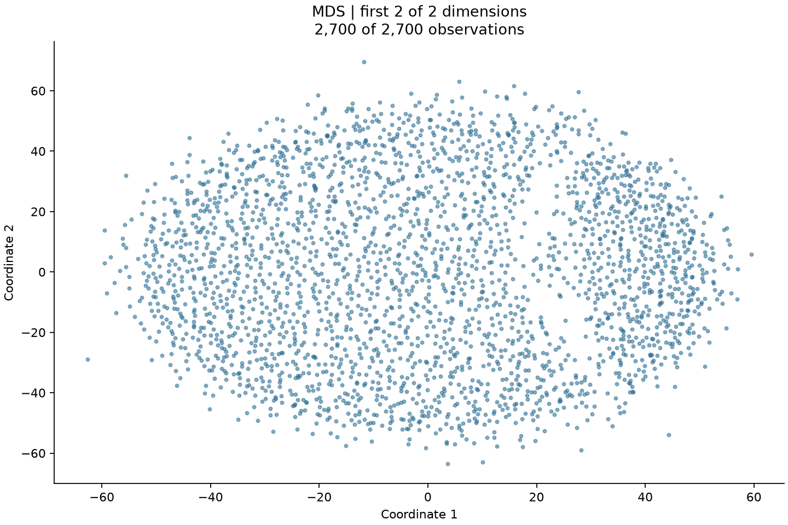

# generated_report_2

Generation mode: evidence_only.

This is a method-level evidence appendix to the [combined dataset report](../../generated_report_2.md).

Evidence links point to bundled JSON records. JSON fragments identify fields. Recorded reasons are planner explanations, not independent proof. Citation validation checks references and fingerprints, not scientific truth.

Verification scope: Python checked preprocessing, execution and evaluation linkage and artifact hashes. This appendix is a deterministic rendering of saved evidence; the combined dataset report contains the model-generated narrative and direct plot interpretation.

This method belongs to a jointly selected set. Other-method assessments below may describe co-selected methods, not exclusions. No ranking is implied.

## Visualization scope

    {
      "sample_size": 2700,
      "representation_dimensions": 2,
      "view_dimensions": 2,
      "color_column": null,
      "color_status": "uncolored",
      "description": "First coordinates of the saved embedding; no new 2D fit."
    }

## Narrative status

This appendix renders recorded settings and results without a separate model request.

## Verbatim decision-time records

These statements were written before fitting. Unknown quantities here may be measured in the later evaluation.

### Preprocessing explanation

    "Recommend total-count normalization and log1p for confirmed raw UMI counts, followed by constant-feature removal while preserving sparse storage and all cells."

### Full preprocessing plan and rationale

    {
      "reason": "User context confirms raw nonnegative integer UMI counts in cells-by-genes orientation. Normalize each cell to a total of 10000 to account for differing count totals, then apply log1p to compress the count range. Normalization must reject negative or noninteger values and zero-total rows; row totals are not established by this profile, so validate before transforming and do not silently drop cells. Remove constant features because 16104 are reported and they provide no variation across cells. Use automatic constant removal rather than explicit feature drops because feature details are truncated. Keep scaling disabled and do not center to preserve sparse storage. Retain error policies for missing, infinite, and all-missing values. Retain all cells and defer additional cell-quality filtering and variable-gene selection. No reduction executes here; the separately configured output dimension remains 2.",
      "schema_version": "1.0",
      "drop_features": [],
      "infinity": "error",
      "missing": "error",
      "all_missing": "error",
      "categorical": "error",
      "remove_constants": true,
      "count_data_confirmed": true,
      "normalize_total": 10000,
      "log1p": true,
      "scale": "none",
      "center": false,
      "max_categories": 100,
      "max_output_features": 100000,
      "max_dense_bytes": 1000000000,
      "ambiguity_resolutions": []
    }

### Method-selection explanation

    "Member of a jointly selected set; alternatives are assessments, not necessarily exclusions."

### Full selected plan, scientific reasons, feasibility reasons, alternatives and limitations

    {
      "method": "mds",
      "n_components": 2,
      "parameters": {
        "max_iter": 300,
        "eps": 1e-06
      },
      "reason": "Execute all four suitable eligible methods sequentially: PCA, MDS, t-SNE and UMAP, without ranking. Preserve preprocessing, all cells, absent labels, resource limits, fixed two-dimensional output and seed 0. Scientific assessments use only the recorded 231-observation sample: distance CV is 0.0541 and the median nearest-to-pairwise distance ratio is 0.8959. Sample union graphs are connected at k=5,15,30, but this establishes neither meaningful neighborhoods nor full-data connectivity. These observations warrant caution rather than a claim that full-data manifold structure is absent.",
      "scientific_reason": "Metric Euclidean MDS directly evaluates a distance-preserving representation of the fixed input. It is a useful global-distance objective even though concentrated sampled distances suggest that a faithful two-dimensional representation may be difficult.",
      "feasibility_reason": "Recorded eligibility is true: 2700 observations are below the 5000 limit and one pairwise array is 58320000 bytes. Quadratic storage and iterative work remain material within the recorded screening.",
      "limitations": [
        "Use metric Euclidean distances, one random initialization and seed 0; 300 iterations and eps=1e-6 are conventional convergence settings, not optimized values.",
        "A single initialization can reach a poor local solution; convergence and distance distortion require assessment.",
        "The memory screen is not a hard process RAM guarantee."
      ],
      "alternatives": {
        "pca": {
          "scientific_reason": "Centered PCA provides a defensible linear variance summary of the fixed transformed features without assuming a manifold. No covariance spectrum is available, so adequacy of two components is unknown.",
          "feasibility_reason": "Recorded eligibility is true. Use the sparse-compatible centered estimator with arpack; do not manually densify or substitute uncentered TruncatedSVD."
        },
        "isomap": {
          "scientific_reason": "Geodesic interpretation needs meaningful local Euclidean neighborhoods. Weak sampled neighbor contrast and sample-only connectivity provide insufficient support for treating graph paths as intrinsic distances in this analysis.",
          "feasibility_reason": "Recorded eligibility is true, but computational eligibility does not resolve the scientific neighborhood concern or establish full-data connectivity."
        },
        "lle": {
          "scientific_reason": "Standard LLE relies on stable local reconstruction weights. The recorded sample provides no local conditioning or reconstruction evidence, while weak neighbor contrast makes this assumption insufficiently supported.",
          "feasibility_reason": "Recorded eligibility is false: sparse LLE is outside the execution contract and implicit densification is prohibited. This exclusion is independent of the scientific assessment."
        },
        "kernel_pca": {
          "scientific_reason": "RBF Kernel PCA would introduce a bandwidth-defined nonlinear geometry without a specific supported nonlinear feature objective here. Concentrated sampled distances give limited justification for replacing the directly interpretable variance and Euclidean-distance objectives with this kernel geometry.",
          "feasibility_reason": "Recorded eligibility is true; quadratic kernel storage passes the recorded screen. Exclusion is scientific, not a claimed resource failure."
        },
        "laplacian_eigenmaps": {
          "scientific_reason": "A binary graph spectral representation depends strongly on meaningful neighborhood membership. Weak sampled distance contrast and connectivity alone do not sufficiently support that graph as the scientific geometry.",
          "feasibility_reason": "Recorded eligibility is true, but the required connected full-data union binary graph has not been established by sample-only diagnostics."
        },
        "diffusion_maps": {
          "scientific_reason": "Interpreting Gaussian-kernel transport requires a defensible affinity scale and treatment of sampling density. The recorded distance concentration and absence of a supported diffusion objective leave that interpretation insufficiently grounded for selection.",
          "feasibility_reason": "Recorded eligibility is true and dense quadratic affinity storage passes the recorded screening. No computational ineligibility is inferred."
        },
        "tsne": {
          "scientific_reason": "t-SNE is suitable for exploratory visualization of local similarities without claiming a global metric or intrinsic manifold. Weak sampled neighbor contrast requires restrained interpretation, but does not by itself invalidate this visualization objective.",
          "feasibility_reason": "Recorded eligibility is true and two dimensions satisfy the Barnes-Hut requirement of one to three dimensions. Use random initialization and no preliminary PCA."
        },
        "umap": {
          "scientific_reason": "UMAP is suitable as an exploratory Euclidean-neighborhood visualization with explicit caution about uncertain local contrast. Selection does not endorse a biological manifold or quantitative interpretation of the layout.",
          "feasibility_reason": "Recorded eligibility is true. Use Euclidean input, random initialization, seed 0 and single-thread optimization, without preliminary PCA or spectral initialization."
        }
      }
    }

### Feasibility screens

    {
      "pca": {
        "eligible": true,
        "reasons": []
      },
      "mds": {
        "eligible": true,
        "reasons": []
      },
      "isomap": {
        "eligible": true,
        "reasons": []
      },
      "lle": {
        "eligible": false,
        "reasons": [
          "Sparse LLE is outside the current execution contract; no implicit densification."
        ]
      },
      "kernel_pca": {
        "eligible": true,
        "reasons": []
      },
      "laplacian_eigenmaps": {
        "eligible": true,
        "reasons": []
      },
      "diffusion_maps": {
        "eligible": true,
        "reasons": []
      },
      "tsne": {
        "eligible": true,
        "reasons": []
      },
      "umap": {
        "eligible": true,
        "reasons": []
      }
    }

## Complete decision and configuration ledger

An aggregate rationale is not a guaranteed field-level justification. Unrecorded provenance and unsupported values are explicitly flagged.

### preprocessing.drop_features

Value:

    []

Decision authority: Saved preprocessing planner proposal.

See the verbatim aggregate preprocessing rationale. A separate field-level reason/evidence mapping was not recorded; support for this individual value is not independently verified.

Evidence: [preprocessing.plan](evidence/preprocessing.json#/plan), [input_profile](evidence/input_profile.json)

### preprocessing.infinity

Value:

    "error"

Decision authority: Saved preprocessing planner proposal.

See the verbatim aggregate preprocessing rationale. A separate field-level reason/evidence mapping was not recorded; support for this individual value is not independently verified.

Evidence: [preprocessing.plan](evidence/preprocessing.json#/plan), [input_profile](evidence/input_profile.json)

### preprocessing.missing

Value:

    "error"

Decision authority: Saved preprocessing planner proposal.

See the verbatim aggregate preprocessing rationale. A separate field-level reason/evidence mapping was not recorded; support for this individual value is not independently verified.

Evidence: [preprocessing.plan](evidence/preprocessing.json#/plan), [input_profile](evidence/input_profile.json)

### preprocessing.all_missing

Value:

    "error"

Decision authority: Saved preprocessing planner proposal.

See the verbatim aggregate preprocessing rationale. A separate field-level reason/evidence mapping was not recorded; support for this individual value is not independently verified.

Evidence: [preprocessing.plan](evidence/preprocessing.json#/plan), [input_profile](evidence/input_profile.json)

### preprocessing.categorical

Value:

    "error"

Decision authority: Saved preprocessing planner proposal.

See the verbatim aggregate preprocessing rationale. A separate field-level reason/evidence mapping was not recorded; support for this individual value is not independently verified.

Evidence: [preprocessing.plan](evidence/preprocessing.json#/plan), [input_profile](evidence/input_profile.json)

### preprocessing.remove_constants

Value:

    true

Decision authority: Saved preprocessing planner proposal.

See the verbatim aggregate preprocessing rationale. A separate field-level reason/evidence mapping was not recorded; support for this individual value is not independently verified.

Evidence: [preprocessing.plan](evidence/preprocessing.json#/plan), [input_profile](evidence/input_profile.json)

### preprocessing.count_data_confirmed

Value:

    true

Decision authority: Saved preprocessing planner proposal.

See the verbatim aggregate preprocessing rationale. A separate field-level reason/evidence mapping was not recorded; support for this individual value is not independently verified.

Evidence: [preprocessing.plan](evidence/preprocessing.json#/plan), [input_profile](evidence/input_profile.json)

### preprocessing.normalize_total

Value:

    10000

Decision authority: Saved preprocessing planner proposal.

See the verbatim aggregate preprocessing rationale. A separate field-level reason/evidence mapping was not recorded; support for this individual value is not independently verified.

Evidence: [preprocessing.plan](evidence/preprocessing.json#/plan), [input_profile](evidence/input_profile.json)

### preprocessing.log1p

Value:

    true

Decision authority: Saved preprocessing planner proposal.

See the verbatim aggregate preprocessing rationale. A separate field-level reason/evidence mapping was not recorded; support for this individual value is not independently verified.

Evidence: [preprocessing.plan](evidence/preprocessing.json#/plan), [input_profile](evidence/input_profile.json)

### preprocessing.scale

Value:

    "none"

Decision authority: Saved preprocessing planner proposal.

See the verbatim aggregate preprocessing rationale. A separate field-level reason/evidence mapping was not recorded; support for this individual value is not independently verified.

Evidence: [preprocessing.plan](evidence/preprocessing.json#/plan), [input_profile](evidence/input_profile.json)

### preprocessing.center

Value:

    false

Decision authority: Saved preprocessing planner proposal.

See the verbatim aggregate preprocessing rationale. A separate field-level reason/evidence mapping was not recorded; support for this individual value is not independently verified.

Evidence: [preprocessing.plan](evidence/preprocessing.json#/plan), [input_profile](evidence/input_profile.json)

### preprocessing.max_categories

Value:

    100

Decision authority: Application-enforced resource setting.

Planner was prohibited from changing this resource setting; its numeric value is an implementation policy, not a measured optimum.

Evidence: [preprocessing.plan](evidence/preprocessing.json#/plan), [input_profile](evidence/input_profile.json)

### preprocessing.max_output_features

Value:

    100000

Decision authority: Application-enforced resource setting.

Planner was prohibited from changing this resource setting; its numeric value is an implementation policy, not a measured optimum.

Evidence: [preprocessing.plan](evidence/preprocessing.json#/plan), [input_profile](evidence/input_profile.json)

### preprocessing.max_dense_bytes

Value:

    1000000000

Decision authority: Application-enforced resource setting.

Planner was prohibited from changing this resource setting; its numeric value is an implementation policy, not a measured optimum.

Evidence: [preprocessing.plan](evidence/preprocessing.json#/plan), [input_profile](evidence/input_profile.json)

### preprocessing.ambiguity_resolutions

Value:

    []

Decision authority: Saved preprocessing planner proposal.

See the verbatim aggregate preprocessing rationale. A separate field-level reason/evidence mapping was not recorded; support for this individual value is not independently verified.

Evidence: [preprocessing.plan](evidence/preprocessing.json#/plan), [input_profile](evidence/input_profile.json)

### selection.method

Value:

    "mds"

Decision authority: Saved method planner proposal within Python eligibility constraints.

See verbatim scientific and feasibility reasons. No comparative optimization establishes this value as best.

Evidence: [selection.plan](evidence/selection.json#/plan), [selection.feasibility_checks](evidence/selection.json#/feasibility_checks), [selection.resource_limits](evidence/selection.json#/resource_limits)

### selection.n_components

Value:

    2

Decision authority: application default (recorded by workflow coordinator).

Exact value and caller/default provenance were saved before planning. This does not establish scientific optimality.

Evidence: [selection.plan](evidence/selection.json#/plan), [selection.feasibility_checks](evidence/selection.json#/feasibility_checks), [selection.resource_limits](evidence/selection.json#/resource_limits), [workflow_config.origins](evidence/workflow_config.json#/origins)

### selection.max_iter

Value:

    300

Decision authority: Saved method planner proposal within Python eligibility constraints.

See verbatim scientific and feasibility reasons. No comparative optimization establishes this value as best.

Evidence: [selection.plan](evidence/selection.json#/plan), [selection.feasibility_checks](evidence/selection.json#/feasibility_checks), [selection.resource_limits](evidence/selection.json#/resource_limits)

### selection.eps

Value:

    1e-06

Decision authority: Saved method planner proposal within Python eligibility constraints.

See verbatim scientific and feasibility reasons. No comparative optimization establishes this value as best.

Evidence: [selection.plan](evidence/selection.json#/plan), [selection.feasibility_checks](evidence/selection.json#/feasibility_checks), [selection.resource_limits](evidence/selection.json#/resource_limits)

### execution.attempt_1.dissimilarity

Value:

    "deprecated"

Decision authority: Executor or library setting; not a separately recorded Codex decision.

Effective value is recorded by the fitted estimator. For parameters outside the plan, no individual scientific tuning justification was recorded.

Evidence: [execution.attempts](evidence/execution.json#/attempts)

### execution.attempt_1.eps

Value:

    1e-06

Decision authority: Copied from saved method plan.

Effective value is recorded by the fitted estimator. For parameters outside the plan, no individual scientific tuning justification was recorded.

Evidence: [execution.attempts](evidence/execution.json#/attempts)

### execution.attempt_1.init

Value:

    "random"

Decision authority: Executor or library setting; not a separately recorded Codex decision.

Effective value is recorded by the fitted estimator. For parameters outside the plan, no individual scientific tuning justification was recorded.

Evidence: [execution.attempts](evidence/execution.json#/attempts)

### execution.attempt_1.max_iter

Value:

    300

Decision authority: Copied from saved method plan.

Effective value is recorded by the fitted estimator. For parameters outside the plan, no individual scientific tuning justification was recorded.

Evidence: [execution.attempts](evidence/execution.json#/attempts)

### execution.attempt_1.metric

Value:

    "euclidean"

Decision authority: Executor or library setting; not a separately recorded Codex decision.

Effective value is recorded by the fitted estimator. For parameters outside the plan, no individual scientific tuning justification was recorded.

Evidence: [execution.attempts](evidence/execution.json#/attempts)

### execution.attempt_1.metric_mds

Value:

    true

Decision authority: Executor or library setting; not a separately recorded Codex decision.

Effective value is recorded by the fitted estimator. For parameters outside the plan, no individual scientific tuning justification was recorded.

Evidence: [execution.attempts](evidence/execution.json#/attempts)

### execution.attempt_1.metric_params

Value:

    null

Decision authority: Executor or library setting; not a separately recorded Codex decision.

Effective value is recorded by the fitted estimator. For parameters outside the plan, no individual scientific tuning justification was recorded.

Evidence: [execution.attempts](evidence/execution.json#/attempts)

### execution.attempt_1.n_components

Value:

    2

Decision authority: Executor or library setting; not a separately recorded Codex decision.

Effective value is recorded by the fitted estimator. For parameters outside the plan, no individual scientific tuning justification was recorded.

Evidence: [execution.attempts](evidence/execution.json#/attempts)

### execution.attempt_1.n_init

Value:

    1

Decision authority: Executor or library setting; not a separately recorded Codex decision.

Effective value is recorded by the fitted estimator. For parameters outside the plan, no individual scientific tuning justification was recorded.

Evidence: [execution.attempts](evidence/execution.json#/attempts)

### execution.attempt_1.n_jobs

Value:

    1

Decision authority: Executor or library setting; not a separately recorded Codex decision.

Effective value is recorded by the fitted estimator. For parameters outside the plan, no individual scientific tuning justification was recorded.

Evidence: [execution.attempts](evidence/execution.json#/attempts)

### execution.attempt_1.normalized_stress

Value:

    false

Decision authority: Executor or library setting; not a separately recorded Codex decision.

Effective value is recorded by the fitted estimator. For parameters outside the plan, no individual scientific tuning justification was recorded.

Evidence: [execution.attempts](evidence/execution.json#/attempts)

### execution.attempt_1.random_state

Value:

    0

Decision authority: Executor or library setting; not a separately recorded Codex decision.

Effective value is recorded by the fitted estimator. For parameters outside the plan, no individual scientific tuning justification was recorded.

Evidence: [execution.attempts](evidence/execution.json#/attempts)

### execution.attempt_1.verbose

Value:

    0

Decision authority: Executor or library setting; not a separately recorded Codex decision.

Effective value is recorded by the fitted estimator. For parameters outside the plan, no individual scientific tuning justification was recorded.

Evidence: [execution.attempts](evidence/execution.json#/attempts)

### selection.max_working_bytes

Value:

    1000000000

Decision authority: application default (recorded by workflow coordinator).

Exact value and caller/default provenance were saved before planning. This does not establish scientific optimality.

Evidence: [selection.resource_limits](evidence/selection.json#/resource_limits), [workflow_config.origins](evidence/workflow_config.json#/origins)

### selection.max_manifold_observations

Value:

    5000

Decision authority: application default (recorded by workflow coordinator).

Exact value and caller/default provenance were saved before planning. This does not establish scientific optimality.

Evidence: [selection.resource_limits](evidence/selection.json#/resource_limits), [workflow_config.origins](evidence/workflow_config.json#/origins)

### evaluation.max_samples

Value:

    512

Decision authority: application default (recorded by workflow coordinator).

Exact value and caller/default provenance were saved before planning. This does not establish scientific optimality.

Evidence: [evaluation.config](evidence/evaluation.json#/config), [workflow_config.origins](evidence/workflow_config.json#/origins)

### evaluation.max_working_bytes

Value:

    128000000

Decision authority: application default (recorded by workflow coordinator).

Exact value and caller/default provenance were saved before planning. This does not establish scientific optimality.

Evidence: [evaluation.config](evidence/evaluation.json#/config), [workflow_config.origins](evidence/workflow_config.json#/origins)

### evaluation.neighbors

Value:

    5

Decision authority: application default (recorded by workflow coordinator).

Exact value and caller/default provenance were saved before planning. This does not establish scientific optimality.

Evidence: [evaluation.config](evidence/evaluation.json#/config), [workflow_config.origins](evidence/workflow_config.json#/origins)

### evaluation.seed

Value:

    0

Decision authority: application default (recorded by workflow coordinator).

Exact value and caller/default provenance were saved before planning. This does not establish scientific optimality.

Evidence: [evaluation.config](evidence/evaluation.json#/config), [workflow_config.origins](evidence/workflow_config.json#/origins)

### evaluation.max_plot_samples

Value:

    10000

Decision authority: application default (recorded by workflow coordinator).

Exact value and caller/default provenance were saved before planning. This does not establish scientific optimality.

Evidence: [evaluation.config](evidence/evaluation.json#/config), [workflow_config.origins](evidence/workflow_config.json#/origins)

### evaluation.max_categories

Value:

    20

Decision authority: application default (recorded by workflow coordinator).

Exact value and caller/default provenance were saved before planning. This does not establish scientific optimality.

Evidence: [evaluation.config](evidence/evaluation.json#/config), [workflow_config.origins](evidence/workflow_config.json#/origins)

### evaluation.threads

Value:

    2

Decision authority: application default (recorded by workflow coordinator).

Exact value and caller/default provenance were saved before planning. This does not establish scientific optimality.

Evidence: [evaluation.config](evidence/evaluation.json#/config), [workflow_config.origins](evidence/workflow_config.json#/origins)

### diagnostics.max_samples

Value:

    512

Decision authority: application default (recorded by workflow coordinator).

Exact value and caller/default provenance were saved before planning. This does not establish scientific optimality.

Evidence: [diagnostics.config](evidence/diagnostics.json#/config), [workflow_config.origins](evidence/workflow_config.json#/origins)

### diagnostics.max_working_bytes

Value:

    128000000

Decision authority: application default (recorded by workflow coordinator).

Exact value and caller/default provenance were saved before planning. This does not establish scientific optimality.

Evidence: [diagnostics.config](evidence/diagnostics.json#/config), [workflow_config.origins](evidence/workflow_config.json#/origins)

### diagnostics.seed

Value:

    0

Decision authority: application default (recorded by workflow coordinator).

Exact value and caller/default provenance were saved before planning. This does not establish scientific optimality.

Evidence: [diagnostics.config](evidence/diagnostics.json#/config), [workflow_config.origins](evidence/workflow_config.json#/origins)

### diagnostics.neighbors

Value:

    [
      5,
      15,
      30
    ]

Decision authority: application default (recorded by workflow coordinator).

Exact value and caller/default provenance were saved before planning. This does not establish scientific optimality.

Evidence: [diagnostics.config](evidence/diagnostics.json#/config), [workflow_config.origins](evidence/workflow_config.json#/origins)

### execution.threads

Value:

    2

Decision authority: application default (recorded by workflow coordinator).

Exact value and caller/default provenance were saved before planning. This does not establish scientific optimality.

Evidence: [execution.threads](evidence/execution.json#/threads), [workflow_config.origins](evidence/workflow_config.json#/origins)

### execution.timeout_seconds_per_attempt

Value:

    600

Decision authority: application default (recorded by workflow coordinator).

Exact value and caller/default provenance were saved before planning. This does not establish scientific optimality.

Evidence: [execution.timeout_seconds_per_attempt](evidence/execution.json#/timeout_seconds_per_attempt), [workflow_config.origins](evidence/workflow_config.json#/origins)

### execution.seed

Value:

    0

Decision authority: Execution configuration.

Resource/reproducibility/failure policy. Caller-vs-default provenance and a per-value rationale were not saved.

Evidence: [execution.seed](evidence/execution.json#/seed)

### execution.allow_fallback

Value:

    true

Decision authority: application default (recorded by workflow coordinator).

Exact value and caller/default provenance were saved before planning. This does not establish scientific optimality.

Evidence: [execution.allow_fallback](evidence/execution.json#/allow_fallback), [workflow_config.origins](evidence/workflow_config.json#/origins)

### workflow.loader.split

Value:

    null

Decision authority: application default.

Initial configuration; unused method/mode-specific settings are retained for reproducibility, not claimed to have been applied.

Evidence: [workflow_config.origins](evidence/workflow_config.json#/origins)

### workflow.loader.orientation

Value:

    null

Decision authority: application default.

Initial configuration; unused method/mode-specific settings are retained for reproducibility, not claimed to have been applied.

Evidence: [workflow_config.origins](evidence/workflow_config.json#/origins)

### workflow.loader.label_column

Value:

    null

Decision authority: application default.

Initial configuration; unused method/mode-specific settings are retained for reproducibility, not claimed to have been applied.

Evidence: [workflow_config.origins](evidence/workflow_config.json#/origins)

### workflow.loader.id_column

Value:

    null

Decision authority: application default.

Initial configuration; unused method/mode-specific settings are retained for reproducibility, not claimed to have been applied.

Evidence: [workflow_config.origins](evidence/workflow_config.json#/origins)

### workflow.method_policy

Value:

    "all_suitable"

Decision authority: application default.

Initial configuration; unused method/mode-specific settings are retained for reproducibility, not claimed to have been applied.

Evidence: [workflow_config.origins](evidence/workflow_config.json#/origins)

### workflow.dimensions

Value:

    2

Decision authority: application default.

Initial configuration; unused method/mode-specific settings are retained for reproducibility, not claimed to have been applied.

Evidence: [workflow_config.origins](evidence/workflow_config.json#/origins)

### workflow.dimension_mode

Value:

    "fixed"

Decision authority: application default.

Initial configuration; unused method/mode-specific settings are retained for reproducibility, not claimed to have been applied.

Evidence: [workflow_config.origins](evidence/workflow_config.json#/origins)

### workflow.dimension_search.max_dimensions

Value:

    20

Decision authority: application default.

Initial configuration; unused method/mode-specific settings are retained for reproducibility, not claimed to have been applied.

Evidence: [workflow_config.origins](evidence/workflow_config.json#/origins)

### workflow.dimension_search.candidates

Value:

    [
      2,
      3,
      5,
      10,
      20
    ]

Decision authority: application default.

Initial configuration; unused method/mode-specific settings are retained for reproducibility, not claimed to have been applied.

Evidence: [workflow_config.origins](evidence/workflow_config.json#/origins)

### workflow.dimension_search.max_fits

Value:

    5

Decision authority: application default.

Initial configuration; unused method/mode-specific settings are retained for reproducibility, not claimed to have been applied.

Evidence: [workflow_config.origins](evidence/workflow_config.json#/origins)

### workflow.dimension_search.total_seconds

Value:

    600

Decision authority: application default.

Initial configuration; unused method/mode-specific settings are retained for reproducibility, not claimed to have been applied.

Evidence: [workflow_config.origins](evidence/workflow_config.json#/origins)

### workflow.dimension_search.variance_target

Value:

    0.9

Decision authority: application default.

Initial configuration; unused method/mode-specific settings are retained for reproducibility, not claimed to have been applied.

Evidence: [workflow_config.origins](evidence/workflow_config.json#/origins)

### workflow.dimension_search.distance_error_target

Value:

    0.1

Decision authority: application default.

Initial configuration; unused method/mode-specific settings are retained for reproducibility, not claimed to have been applied.

Evidence: [workflow_config.origins](evidence/workflow_config.json#/origins)

### workflow.dimension_search.trustworthiness_target

Value:

    0.95

Decision authority: application default.

Initial configuration; unused method/mode-specific settings are retained for reproducibility, not claimed to have been applied.

Evidence: [workflow_config.origins](evidence/workflow_config.json#/origins)

### workflow.dimension_search.reconstruction_target

Value:

    0.1

Decision authority: application default.

Initial configuration; unused method/mode-specific settings are retained for reproducibility, not claimed to have been applied.

Evidence: [workflow_config.origins](evidence/workflow_config.json#/origins)

### workflow.dimension_search.reconstruction_weight

Value:

    0.1

Decision authority: application default.

Initial configuration; unused method/mode-specific settings are retained for reproducibility, not claimed to have been applied.

Evidence: [workflow_config.origins](evidence/workflow_config.json#/origins)

### workflow.dimension_search.complexity_penalty

Value:

    0.01

Decision authority: application default.

Initial configuration; unused method/mode-specific settings are retained for reproducibility, not claimed to have been applied.

Evidence: [workflow_config.origins](evidence/workflow_config.json#/origins)

### workflow.dimension_search.min_improvement

Value:

    0.005

Decision authority: application default.

Initial configuration; unused method/mode-specific settings are retained for reproducibility, not claimed to have been applied.

Evidence: [workflow_config.origins](evidence/workflow_config.json#/origins)

### workflow.dimension_search.plateau_patience

Value:

    2

Decision authority: application default.

Initial configuration; unused method/mode-specific settings are retained for reproducibility, not claimed to have been applied.

Evidence: [workflow_config.origins](evidence/workflow_config.json#/origins)

### workflow.dimension_search.evaluation_samples

Value:

    256

Decision authority: application default.

Initial configuration; unused method/mode-specific settings are retained for reproducibility, not claimed to have been applied.

Evidence: [workflow_config.origins](evidence/workflow_config.json#/origins)

### workflow.dimension_search.evaluation_neighbors

Value:

    5

Decision authority: application default.

Initial configuration; unused method/mode-specific settings are retained for reproducibility, not claimed to have been applied.

Evidence: [workflow_config.origins](evidence/workflow_config.json#/origins)

### workflow.preprocessing_attempts

Value:

    2

Decision authority: application default.

Initial configuration; unused method/mode-specific settings are retained for reproducibility, not claimed to have been applied.

Evidence: [workflow_config.origins](evidence/workflow_config.json#/origins)

### workflow.selection_attempts

Value:

    1

Decision authority: application default.

Initial configuration; unused method/mode-specific settings are retained for reproducibility, not claimed to have been applied.

Evidence: [workflow_config.origins](evidence/workflow_config.json#/origins)

### workflow.max_model_calls

Value:

    5

Decision authority: application default.

Initial configuration; unused method/mode-specific settings are retained for reproducibility, not claimed to have been applied.

Evidence: [workflow_config.origins](evidence/workflow_config.json#/origins)

### workflow.planner_timeout

Value:

    180

Decision authority: application default.

Initial configuration; unused method/mode-specific settings are retained for reproducibility, not claimed to have been applied.

Evidence: [workflow_config.origins](evidence/workflow_config.json#/origins)

### workflow.resources.max_working_bytes

Value:

    1000000000

Decision authority: application default.

Initial configuration; unused method/mode-specific settings are retained for reproducibility, not claimed to have been applied.

Evidence: [workflow_config.origins](evidence/workflow_config.json#/origins)

### workflow.resources.max_manifold_observations

Value:

    5000

Decision authority: application default.

Initial configuration; unused method/mode-specific settings are retained for reproducibility, not claimed to have been applied.

Evidence: [workflow_config.origins](evidence/workflow_config.json#/origins)

### workflow.diagnostics.max_samples

Value:

    512

Decision authority: application default.

Initial configuration; unused method/mode-specific settings are retained for reproducibility, not claimed to have been applied.

Evidence: [workflow_config.origins](evidence/workflow_config.json#/origins)

### workflow.diagnostics.max_working_bytes

Value:

    128000000

Decision authority: application default.

Initial configuration; unused method/mode-specific settings are retained for reproducibility, not claimed to have been applied.

Evidence: [workflow_config.origins](evidence/workflow_config.json#/origins)

### workflow.diagnostics.seed

Value:

    0

Decision authority: application default.

Initial configuration; unused method/mode-specific settings are retained for reproducibility, not claimed to have been applied.

Evidence: [workflow_config.origins](evidence/workflow_config.json#/origins)

### workflow.diagnostics.neighbors

Value:

    [
      5,
      15,
      30
    ]

Decision authority: application default.

Initial configuration; unused method/mode-specific settings are retained for reproducibility, not claimed to have been applied.

Evidence: [workflow_config.origins](evidence/workflow_config.json#/origins)

### workflow.execution.timeout

Value:

    600

Decision authority: application default.

Initial configuration; unused method/mode-specific settings are retained for reproducibility, not claimed to have been applied.

Evidence: [workflow_config.origins](evidence/workflow_config.json#/origins)

### workflow.execution.threads

Value:

    2

Decision authority: application default.

Initial configuration; unused method/mode-specific settings are retained for reproducibility, not claimed to have been applied.

Evidence: [workflow_config.origins](evidence/workflow_config.json#/origins)

### workflow.execution.allow_fallback

Value:

    true

Decision authority: application default.

Initial configuration; unused method/mode-specific settings are retained for reproducibility, not claimed to have been applied.

Evidence: [workflow_config.origins](evidence/workflow_config.json#/origins)

### workflow.evaluation.max_samples

Value:

    512

Decision authority: application default.

Initial configuration; unused method/mode-specific settings are retained for reproducibility, not claimed to have been applied.

Evidence: [workflow_config.origins](evidence/workflow_config.json#/origins)

### workflow.evaluation.max_working_bytes

Value:

    128000000

Decision authority: application default.

Initial configuration; unused method/mode-specific settings are retained for reproducibility, not claimed to have been applied.

Evidence: [workflow_config.origins](evidence/workflow_config.json#/origins)

### workflow.evaluation.neighbors

Value:

    5

Decision authority: application default.

Initial configuration; unused method/mode-specific settings are retained for reproducibility, not claimed to have been applied.

Evidence: [workflow_config.origins](evidence/workflow_config.json#/origins)

### workflow.evaluation.seed

Value:

    0

Decision authority: application default.

Initial configuration; unused method/mode-specific settings are retained for reproducibility, not claimed to have been applied.

Evidence: [workflow_config.origins](evidence/workflow_config.json#/origins)

### workflow.evaluation.max_plot_samples

Value:

    10000

Decision authority: application default.

Initial configuration; unused method/mode-specific settings are retained for reproducibility, not claimed to have been applied.

Evidence: [workflow_config.origins](evidence/workflow_config.json#/origins)

### workflow.evaluation.max_categories

Value:

    20

Decision authority: application default.

Initial configuration; unused method/mode-specific settings are retained for reproducibility, not claimed to have been applied.

Evidence: [workflow_config.origins](evidence/workflow_config.json#/origins)

### workflow.evaluation.threads

Value:

    2

Decision authority: application default.

Initial configuration; unused method/mode-specific settings are retained for reproducibility, not claimed to have been applied.

Evidence: [workflow_config.origins](evidence/workflow_config.json#/origins)

### workflow.report.name

Value:

    "generated_report_2"

Decision authority: caller configuration.

Initial configuration; unused method/mode-specific settings are retained for reproducibility, not claimed to have been applied.

Evidence: [workflow_config.origins](evidence/workflow_config.json#/origins)

### workflow.report.mode

Value:

    "codex"

Decision authority: application default.

Initial configuration; unused method/mode-specific settings are retained for reproducibility, not claimed to have been applied.

Evidence: [workflow_config.origins](evidence/workflow_config.json#/origins)

### workflow.report.timeout

Value:

    300

Decision authority: caller configuration.

Initial configuration; unused method/mode-specific settings are retained for reproducibility, not claimed to have been applied.

Evidence: [workflow_config.origins](evidence/workflow_config.json#/origins)

### workflow.report.color_column

Value:

    null

Decision authority: application default.

Initial configuration; unused method/mode-specific settings are retained for reproducibility, not claimed to have been applied.

Evidence: [workflow_config.origins](evidence/workflow_config.json#/origins)

## Post-execution observations

These results assess the output; they were not known when the original method was chosen.

### Every execution attempt, effective parameters, warnings and errors

    [
      {
        "plan": {
          "method": "mds",
          "n_components": 2,
          "parameters": {
            "max_iter": 300,
            "eps": 1e-06
          },
          "reason": "Execute all four suitable eligible methods sequentially: PCA, MDS, t-SNE and UMAP, without ranking. Preserve preprocessing, all cells, absent labels, resource limits, fixed two-dimensional output and seed 0. Scientific assessments use only the recorded 231-observation sample: distance CV is 0.0541 and the median nearest-to-pairwise distance ratio is 0.8959. Sample union graphs are connected at k=5,15,30, but this establishes neither meaningful neighborhoods nor full-data connectivity. These observations warrant caution rather than a claim that full-data manifold structure is absent.",
          "scientific_reason": "Metric Euclidean MDS directly evaluates a distance-preserving representation of the fixed input. It is a useful global-distance objective even though concentrated sampled distances suggest that a faithful two-dimensional representation may be difficult.",
          "feasibility_reason": "Recorded eligibility is true: 2700 observations are below the 5000 limit and one pairwise array is 58320000 bytes. Quadratic storage and iterative work remain material within the recorded screening.",
          "limitations": [
            "Use metric Euclidean distances, one random initialization and seed 0; 300 iterations and eps=1e-6 are conventional convergence settings, not optimized values.",
            "A single initialization can reach a poor local solution; convergence and distance distortion require assessment.",
            "The memory screen is not a hard process RAM guarantee."
          ],
          "alternatives": {
            "pca": {
              "scientific_reason": "Centered PCA provides a defensible linear variance summary of the fixed transformed features without assuming a manifold. No covariance spectrum is available, so adequacy of two components is unknown.",
              "feasibility_reason": "Recorded eligibility is true. Use the sparse-compatible centered estimator with arpack; do not manually densify or substitute uncentered TruncatedSVD."
            },
            "isomap": {
              "scientific_reason": "Geodesic interpretation needs meaningful local Euclidean neighborhoods. Weak sampled neighbor contrast and sample-only connectivity provide insufficient support for treating graph paths as intrinsic distances in this analysis.",
              "feasibility_reason": "Recorded eligibility is true, but computational eligibility does not resolve the scientific neighborhood concern or establish full-data connectivity."
            },
            "lle": {
              "scientific_reason": "Standard LLE relies on stable local reconstruction weights. The recorded sample provides no local conditioning or reconstruction evidence, while weak neighbor contrast makes this assumption insufficiently supported.",
              "feasibility_reason": "Recorded eligibility is false: sparse LLE is outside the execution contract and implicit densification is prohibited. This exclusion is independent of the scientific assessment."
            },
            "kernel_pca": {
              "scientific_reason": "RBF Kernel PCA would introduce a bandwidth-defined nonlinear geometry without a specific supported nonlinear feature objective here. Concentrated sampled distances give limited justification for replacing the directly interpretable variance and Euclidean-distance objectives with this kernel geometry.",
              "feasibility_reason": "Recorded eligibility is true; quadratic kernel storage passes the recorded screen. Exclusion is scientific, not a claimed resource failure."
            },
            "laplacian_eigenmaps": {
              "scientific_reason": "A binary graph spectral representation depends strongly on meaningful neighborhood membership. Weak sampled distance contrast and connectivity alone do not sufficiently support that graph as the scientific geometry.",
              "feasibility_reason": "Recorded eligibility is true, but the required connected full-data union binary graph has not been established by sample-only diagnostics."
            },
            "diffusion_maps": {
              "scientific_reason": "Interpreting Gaussian-kernel transport requires a defensible affinity scale and treatment of sampling density. The recorded distance concentration and absence of a supported diffusion objective leave that interpretation insufficiently grounded for selection.",
              "feasibility_reason": "Recorded eligibility is true and dense quadratic affinity storage passes the recorded screening. No computational ineligibility is inferred."
            },
            "tsne": {
              "scientific_reason": "t-SNE is suitable for exploratory visualization of local similarities without claiming a global metric or intrinsic manifold. Weak sampled neighbor contrast requires restrained interpretation, but does not by itself invalidate this visualization objective.",
              "feasibility_reason": "Recorded eligibility is true and two dimensions satisfy the Barnes-Hut requirement of one to three dimensions. Use random initialization and no preliminary PCA."
            },
            "umap": {
              "scientific_reason": "UMAP is suitable as an exploratory Euclidean-neighborhood visualization with explicit caution about uncertain local contrast. Selection does not endorse a biological manifold or quantitative interpretation of the layout.",
              "feasibility_reason": "Recorded eligibility is true. Use Euclidean input, random initialization, seed 0 and single-thread optimization, without preliminary PCA or spectral initialization."
            }
          }
        },
        "status": "complete",
        "metrics": {
          "raw_stress": 2276738352.42381,
          "iterations": 300,
          "iteration_limit_reached": true
        },
        "effective_parameters": {
          "dissimilarity": "deprecated",
          "eps": 1e-06,
          "init": "random",
          "max_iter": 300,
          "metric": "euclidean",
          "metric_mds": true,
          "metric_params": null,
          "n_components": 2,
          "n_init": 1,
          "n_jobs": 1,
          "normalized_stress": false,
          "random_state": 0,
          "verbose": 0
        },
        "dependency_versions": {},
        "warnings": [],
        "elapsed_seconds": 23.05917345900525
      }
    ]

### Execution notices and fallback disclosure

    {
      "fallback_occurred": false,
      "fallback_planner_calls": 0,
      "notices": [
        "EXECUTION SUCCEEDED: mds {\"max_iter\": 300, \"eps\": 1e-06}"
      ],
      "dimension_mode": "fixed",
      "selected_dimensions": 2
    }

### Full-representation evaluation

    {
      "sample_size": 128,
      "metrics": {
        "trustworthiness": 0.664609375,
        "normalized_distance_error": 0.40217597352850243,
        "scale_aligned_distance_error": 0.4013284248274045,
        "distance_spearman": 0.533744376070878,
        "neighbor_overlap": 0.0921875
      },
      "skipped": {},
      "neighbors": 5,
      "distance_scale_factor": 1.0293268541182765
    }

### Coordinate-view evaluation

    {
      "sample_size": 128,
      "metrics": {
        "trustworthiness": 0.664609375,
        "normalized_distance_error": 0.40217597352850243,
        "scale_aligned_distance_error": 0.4013284248274045,
        "distance_spearman": 0.533744376070878,
        "neighbor_overlap": 0.0921875
      },
      "skipped": {},
      "neighbors": 5,
      "distance_scale_factor": 1.0293268541182765
    }

### Evaluation limitations

    [
      "Metrics compare Euclidean distances in preprocessed feature space, not raw data or biological truth.",
      "Neighborhoods are within the recorded sample, not the full dataset; ties can affect ranks.",
      "Scores are descriptive in-sample evidence, not held-out validation or proof of an optimal plan.",
      "Memory estimate bounds working arrays heuristically; input storage and library overhead are excluded.",
      "First-coordinate plots can hide structure. Labels color plots only and do not influence scores.",
      "Euclidean distortion need not match nonlinear methods objectives; no universal pass/fail threshold."
    ]

## Evidence gaps and limits of attribution

- Recorded preprocessing reasons are aggregate prose, not per-operation evidence mappings.
- A recorded setting does not establish why that exact numerical value is best; many settings are application policies or library defaults.
- The bundled workflow configuration records caller overrides and defaults. Estimator settings outside the selected plan do not necessarily have individual tuning rationales.
- No exhaustive method comparison or scientific-optimality proof was performed.
- Model synthesis can be mistaken despite valid citations. Full records allow human review.
- This evidence appendix contains no independent visual assessment. The combined report interprets the supplied plot alongside its numerical evidence.

## Source bundle and reproducibility

See [manifest](manifest.json), [evidence catalog](evidence_catalog.json), [decision ledger](decision_ledger.json) and [generation status](report_generation.json). Original JSON files are copied without modifying their contents. Local source paths identify the analyzed files; reading this appendix does not require those paths to exist.

- [input_profile](evidence/input_profile.json)
- [preprocessing](evidence/preprocessing.json)
- [preprocessing_audit](evidence/preprocessing_audit.json)
- [processed_profile](evidence/processed_profile.json)
- [selection](evidence/selection.json)
- [selection_evidence](evidence/selection_evidence.json)
- [diagnostics](evidence/diagnostics.json)
- [execution](evidence/execution.json)
- [evaluation](evidence/evaluation.json)
- [workflow_config](evidence/workflow_config.json)
